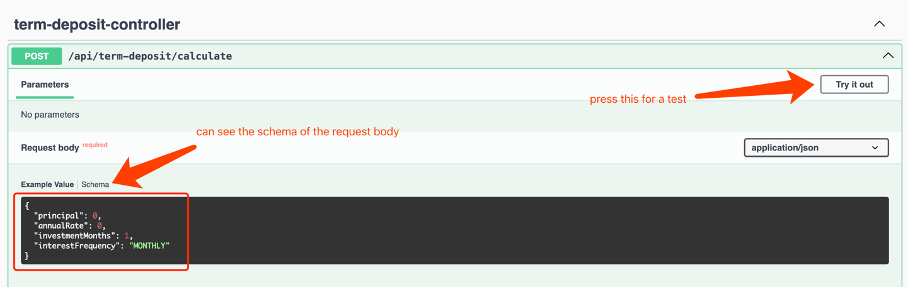

# Introduction to Design and Implementation

Choosing a Spring Boot application to provide a REST API for 
this term deposit calculator. I used the swagger documentation for testing here instead of a html ui.
And the API can be used by any front end to have UI if needed.
The application uses a traditional layered architecture:

- **Controller Layer**:
  - `TermDepositController.java`: Handles HTTP requests and responses for the calculation of term deposit API.

- **Service Layer**:
  - `TermDepositService`: Contains the logic for processing the calculation based on inputs

- **Model Layer**:
  - Represents the data and business objects.

- **Exception Handling**:
  - using annotations and `GlobalExceptionHandler`

# Execution Instructions
## Prerequisites:
- Java Development Kit (JDK) 17 or later installed.
- Maven is required to build and manage the project.

## Setup:

1. **Clone the Repository**:
    ```bash
    git clone https://github.com/LisaCao0513/TermDepositCalculator.git
    cd DepositCalculator // your project folder
    ```

2. **Build and Run the Project**:
    ```bash
    mvn clean package
    java -jar target/term-deposit-service-0.0.1-SNAPSHOT.jar
    ```

3. **Access the API**:
- Base URL: `http://localhost:8080/swagger-ui/index.html`
- Temp AWS service URL: `http://termdepositcalculator.ap-southeast-2.elasticbeanstalk.com/swagger-ui/index.html`
- Endpoint: `POST /api/term-deposit/calculator`

Test in swagger


4. **Sample API Request Responses**:

- Sample Request

```json
{
  "principal": 10000,
  "annualRate": 1.1,
  "investmentMonths": 12,
  "interestFrequency": "MONTHLY"
}
```

- Sample Success Response

```json
{
  "finalBalance": 10022
}
```

- sample error response:
```json
{
  "status": 400,
  "error": "Validation Failed",
  "message": "{principal=Principal amount must be non-negative}"
}
```
5. **Unit Testing:**

- To run unit tests
```bash
mvn test
```

### Notes:
- *BigDecimal*: Using BigDecimal ensures accurate financial computations and avoids issues related to floating-point precision. BigDecimal is used for precision in financial calculations but can be more cumbersome to work with compared to primitive types.
- *Test Coverage*: More Test Coverage is needed for controller and more test cases while not have enough time to do that.
- *The calculation* got the equations from web. Support reinvest interest type only. 
  1. when interest paid at maturity, use AtMaturityTermDepositInterestStrategy - "A=p + p * r * n"
  2. when interest not paid at maturity, use ReinvestTermDepositInterestStrategy - "A=P * （1+r/n）^ nt"
  3. using term in Months to do the calculator by divide Months/12 to get in year.
  4. round up model here are HALF_UP for scale and HALF_EVEN for calculate